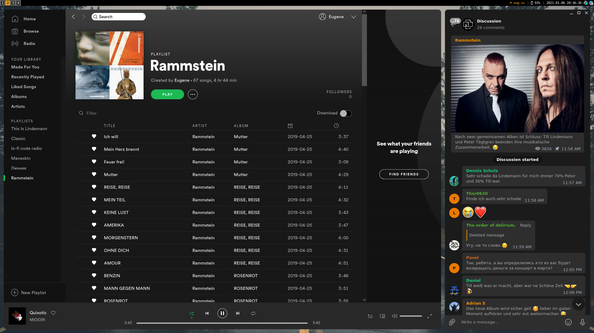

# dotfiles
This repo contains dotfiles, configs and environment settings for my Arch setup.
Documentation is managed via [vimwiki](https://github.com/vimwiki/vimwiki) plugin.

Github repo: [dotfiles](https://github.com/eug-vs/dotfiles)

Author: [eug-vs](https://github.com/eug-vs/)

Documentation: [wiki](../Documents/wiki/index.md)

## Installation
1. Checkout into bare git repository:
   ```sh
   git clone --bare https://github.com/eug-vs/dotfiles $HOME/.dotfiles.git
   ```
2. Setup local alias to simplify your life:
   ```
   alias config='git --git-dir=$HOME/.dotfiles.git --work-tree=$HOME'
   ```
3. Hide untracked files:
   ```
   config config --local status.showUntrackedFiles no
   ```
4. Backup you current dotfiles (if any)
5. Run `config checkout master`

## Screenshots




