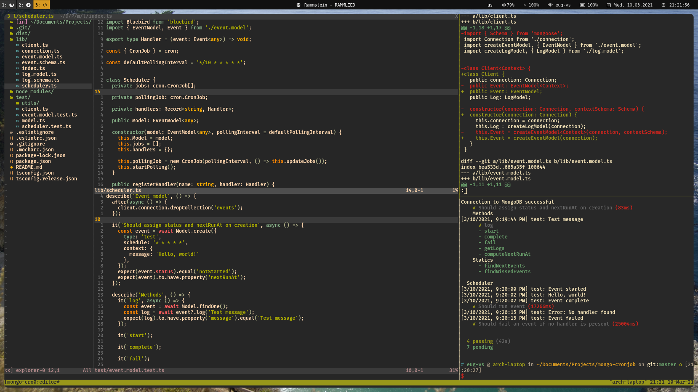
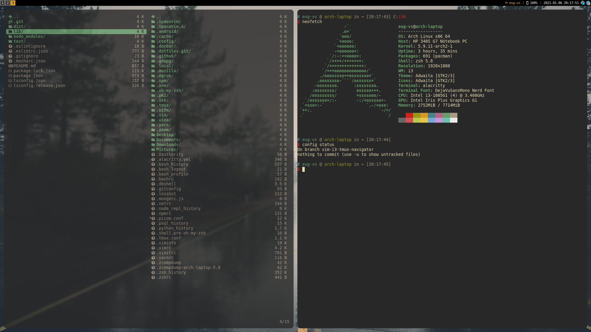

# dotfiles
This repo contains dotfiles, configs and environment settings for my Arch setup.
Documentation is managed via [vimwiki](https://github.com/vimwiki/vimwiki) plugin.

Github repo: [dotfiles](https://github.com/eug-vs/dotfiles)

Author: [eug-vs](https://github.com/eug-vs/)

Documentation: [wiki](../Documents/wiki/index.md)

## Preview

